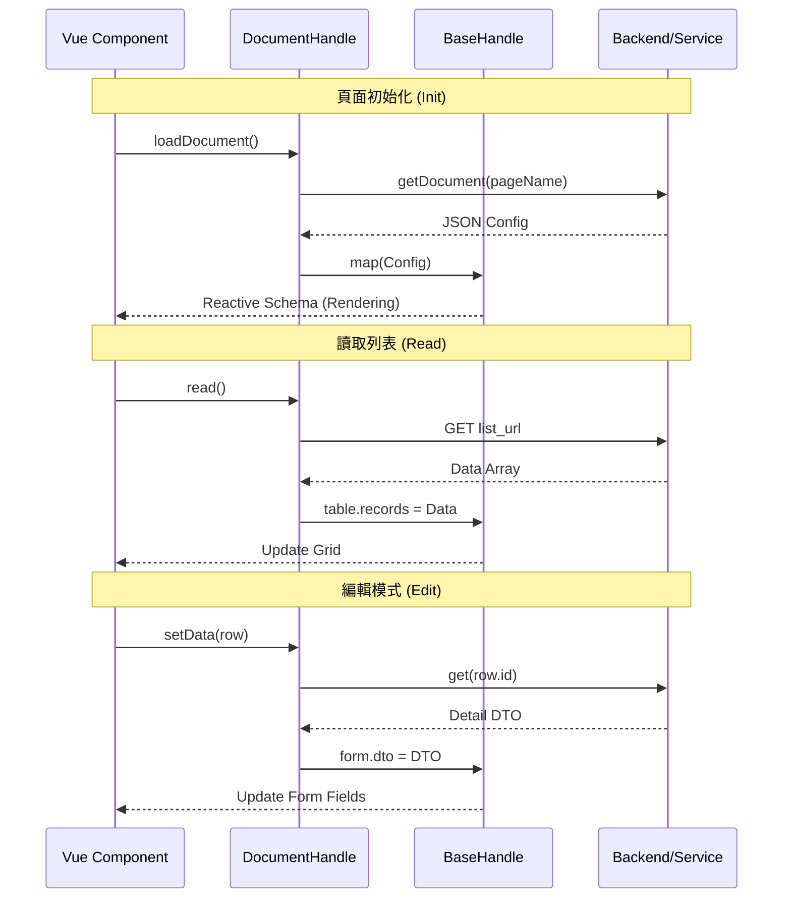

# BaseHandle 技術說明文件
這份文件說明了 `BaseHandle.ts` 的架構設計與功能。這是一個 **核心狀態管理類別 (Base Class)**，專門用於 Vue 3 專案中，負責將後端或設定檔傳入的 **JSON 配置 (Configuration)** 轉換為前端可用的 **響應式狀態 (Reactive State)**。

## 1. 概要 (Overview)
`BaseHandle` 是一個用於管理頁面結構化數據的類別。它採用「配置驅動 (Configuration-Driven)」的模式，接收包含不同區塊（Section）的數據物件，並將其解析為表格 (Table)、表單 (Form)、搜尋 (Search) 與 API 設定。

**主要職責：**

* 定義頁面標準的響應式數據結構（State）。
* 提供解析器 (`map` 方法)，將原始配置映射到對應的狀態屬性。
* 提供基礎的防呆與資料初始化邏輯。

---

## 2. 核心屬性 (Properties)
此類別大量使用 Vue 3 的 `reactive` 與 `ref` 來確保數據變更時能觸發 UI 更新。

| 屬性名稱 | 類型 | 說明 |
| --- | --- | --- |
| **apiUrl** | `ref<any>` | 儲存該頁面相關的 API 路徑設定。 |
| **sections** | `reactive<any[]>` | 儲存原始的區塊配置陣列（深拷貝備份）。 |
| **table** | `reactive` | **表格狀態容器**。<br>- `options`: AgGrid 或表格套件設定。<br>- `records`: 表格資料列 (Row Data)。<br>- `columns`: 欄位定義。<br>- `actions`: 操作按鈕設定。 |
| **page** | `reactive` | **頁面中繼資料**。包含 `name`, `code`, `docNo`, `id` 等識別資訊。 |
| **document** | `reactive` | **文件描述資料**。包含 `orgId`, `docName`, `version`, `content` 等。 |
| **search** | `reactive` | **搜尋欄位狀態容器**。<br>- `params`: 搜尋參數預設值。<br>- `schemas`: 搜尋欄位的 UI 定義 (Schema)。 |
| **form** | `reactive` | **表單狀態容器**。<br>- `dto`: 資料傳輸物件 (Data Transfer Object)，即表單綁定的 Model。<br>- `schemas`: 表單欄位 UI 定義。<br>- `column`: 表單佈局欄數 (預設 12)。<br>- `isReadonly`: 是否唯讀。 |

<div style="page-break-after: always;"></div>

## 3. 核心方法 (Methods)
### 3.1 `map(data: any)`
**用途**：資料解析入口點。
**邏輯**：

1. 將傳入的 `data.sections` 進行深拷貝 (`cloneDeep`) 並存入 `this.sections`。
2. 遍歷 `sections`，根據 `sectionType` 分流至對應的處理函式：
* `Params` -> `mapParams`
* `Form` -> `mapForm`
* `Search` -> `mapSearch`
* `Table` -> `mapTable`

### 3.2 子映射方法 (Sub-mapping methods)
這些方法負責將特定的 Section 配置寫入對應的響應式屬性中。

* **`mapParams(section)`**
* 讀取 `section.apiUrl` 並寫入 `this.apiUrl`。
* 用途：設定頁面 CRUD 所需的 API Endpoint。


* **`mapForm(section)`**
* 解析表單配置。
* 設定 `column` (佈局)、`dto` (資料模型)、`schemas` (欄位定義)。


* **`mapSearch(section)`**
* 解析搜尋列配置。
* 設定 `params` (搜尋條件) 與 `schemas` (搜尋欄位定義)。


* **`mapTable(section)`**
* 解析表格配置。
* 設定 `options` (表格設定)、`columns` (表頭定義)、`actions` (功能按鈕)。
* *(註解掉的 `singleRow` 邏輯保留了未來擴充的可能性)*。


### 3.3 `renderForm(f: any)`**用途**：手動渲染或重置表單狀態。
**邏輯**：

* 接收一個表單配置物件 `f`。
* 使用 `isEmptyOrNull` 檢查各屬性，若為空則給予預設值 (null 或 空陣列)。
* 主要用於動態切換表單或重置表單時，確保資料結構的完整性。

<div style="page-break-after: always;"></div>

## 4. 設計模式分析
此類別實現了 **Adapter (轉接器) 模式** 與 **State Container (狀態容器) 模式** 的混合體：

1. **統一接口**：無論後端傳來的 JSON 結構多麼複雜，經過 `map()` 方法後，前端組件（如 `AgGridView`, `ElFormCustom`）只需要綁定 `BaseHandle` 中的標準屬性（如 `instance.table.columns`）。
2. **關注點分離**：
* `BaseHandle` 負責資料結構的解析與狀態持有。
* UI 組件 (Vue Components) 負責渲染。
* `DocumentHandle` (在上一段程式碼中看到) 繼承或使用此類別來執行具體的 CRUD 業務邏輯。


## 5. 使用範例 (虛擬碼)
```typescript
// 在 DocumentHandle 或其他邏輯層中使用
const base = new BaseHandle();

// 假設從後端取得的配置
const configData = {
  sections: [
    {
      sectionType: "Search",
      schemas: [{ label: "姓名", field: "name", type: "text" }]
    },
    {
      sectionType: "Table",
      columns: [{ headerName: "姓名", field: "name" }],
      actions: [{ label: "編輯", event: "edit" }]
    }
  ]
};

// 初始化狀態
base.map(configData);

// 此時 base.search.schemas 和 base.table.columns 已被自動填入
// 前端模板可直接使用
// <ElSearchCustom :schemas="base.search.schemas" />

```

<div style="page-break-after: always;"></div>

# DocumentHandle 技術說明文件
說明 `DocumentHandle` 的架構設計與功能。這是一個 **Vue 3 Composable (Hook)**，作為 **業務邏輯層 (Service Layer)**，負責串接 UI 組件、狀態管理 (`BaseHandle`) 與後端 API。

## 1. 概要 (Overview)
`DocumentHandle` 是一個封裝了完整 CRUD 邏輯的 Composable 函式。它不直接管理狀態（狀態由 `BaseHandle` 管理），而是負責「行為」與「流程控制」。

**主要職責：**

* **配置載入**：從後端或本地載入頁面配置 (JSON Schema)。
* **狀態初始化**：實例化 `BaseHandle` 並注入配置。
* **資料流轉換**：處理表單資料在「顯示格式」與「傳輸格式」之間的轉換（如 `objectToArray`）。
* **CRUD 操作**：標準化的 API 請求封裝 (Read, Get, Create, Update)。
* **選項快取**：自動為 Select 類型的欄位載入選項資料。

---

## 2. 核心成員 (Core Members)
### 2.1 狀態實例
| 變數 | 來源 | 說明 |
| --- | --- | --- |
| **instance** | `new BaseHandle()` | 單一真值來源 (Single Source of Truth)。所有的 UI (表格、表單、搜尋) 都綁定此實例中的數據。 |
| **route** | `useRoute()` | 用於獲取當前頁面的 `name`，以此決定要載入哪一份設定檔。 |

---

## 3. 方法詳解 (Methods API)
### 3.1 初始化與配置 (Initialization)
#### `loadDocument(document?: string)`
* **用途**：主要初始化方法。從後端服務獲取頁面配置 (JSON String)。
* **流程**：
1. 決定組件名稱（預設使用 `route.name`，也可傳入參數覆蓋）。
2. 呼叫 `getDocument` API。
3. 解析回傳的 JSON 字串 (`JSON.parse`)。
4. 呼叫 `instance.map()` 將配置映射到狀態中。


* **回傳**：`Promise<boolean>`

#### `loadJson()`
* **用途**：(備用/開發用) 從本地 `/json/` 目錄載入靜態 JSON 檔案。
* **流程**：使用 `axios` 直接請求靜態資源並映射。

---

### 3.2 表單與資料處理 (Form & Data Handling)
#### `cleanData()`* **用途**：**準備「新增」模式**。重置表單為預設值。
* **流程**：
1. 找到配置中的 `Form`區塊。
2. 呼叫 `formChenge()` 載入下拉選單選項。
3. 使用 `cloneDeep` 將設定檔中的 `dto` (預設值) 複製到 `instance.form.dto`。
4. 執行 `objectToArray` 進行格式轉換（適配特定 UI 組件需求）。

#### `setData(data: any)`* **用途**：**準備「編輯」模式**。回填資料到表單。
* **流程**：
1. 呼叫 `formChenge()` 載入下拉選單選項。
2. 呼叫 `get(data.id)` 從後端獲取最新單筆資料 (DTO)。
3. 將獲取的 DTO 複製到 `instance.form.dto`。
4. 執行 `objectToArray` 進行格式轉換。

#### `cleanSearch()`* **用途**：重置搜尋條件。
* **流程**：還原 `instance.search.params` 至配置檔中的初始狀態。

#### `formChenge()` (內部私有方法)* **用途**：動態載入選項資料。
* **邏輯**：遍歷 `instance.form.schemas`，若欄位類型為 `select` 或 `multiple-select`，則呼叫 `getCacheOptions` 獲取選項並填入 `schema.options`。

---

### 3.3 CRUD 操作 (Data Persistence)
所有 API 路徑皆讀取自 `instance.apiUrl` (由配置檔定義)。

| 方法 | HTTP 方法 | 參數 | 說明 |
| --- | --- | --- | --- |
| **read()** | `GET` | 無 | 讀取列表資料，結果存入 `instance.table.records`。 |
| **get(id)** | `GET` | `id` | 讀取單筆詳細資料，回傳 `Promise<data>`。 |
| **create(data)** | `POST` | `dto` | 新增資料。 |
| **update(data)** | `PUT` | `dto` | 更新資料。路徑通常為 `createUrl/{id}`。 |

<div style="page-break-after: always;"></div>

## 4. 資料流向圖 (Data Flow)


<div style="page-break-after: always;"></div>

## 5. 依賴關係 (Dependencies)* 
**Libraries**:
* `axios`: HTTP 請求。
* `lodash`: `cloneDeep` 深拷貝，防止物件參考污染。
* `vue-router`: 路由感知。


**Project Utils**:
* `http-operations`: 統一的 Axios 封裝。
* `service`: API 服務層定義。
* `utils/index`: `objectToArray` (資料格式轉換), `getCacheOptions` (選項快取)。

<div style="page-break-after: always;"></div>

# Vue 3 CRUD 通用頁面組件說明文件
文件說名 **Vue 3 通用 CRUD（增刪改查）管理頁面**。  
它高度依賴封裝好的 Hooks (`DocumentHandle`) 和自定義組件，實現了「低代碼」風格的開發模式，即通過配置（Config/Schema）來驅動頁面的渲染與邏輯。

以下是為程式碼的技術說明文件：
## 1. 概要 (Overview)
此組件是一個標準的後台管理頁面，具備以下功能：

* **列表展示**：使用 `AgGridView` 顯示數據，支援分頁與多選。
* **搜尋過濾**：使用 `ElSearchCustom` 根據配置動態生成搜尋欄位。
* **新增/編輯**：使用 `ElDialogCustom` 彈窗包裹 `ElFormCustom` 動態表單進行資料維護。
* **邏輯封裝**：透過 `DocumentHandle` 統一管理 API 請求、資料結構定義（Schema）與 CRUD 操作。

---

## 2. 核心依賴與 Hook (Core Dependencies)
組件依賴以下關鍵的 Composable (Hooks) 與工具：

| 名稱 | 來源 | 用途 |
| --- | --- | --- |
| **DocumentHandle** | `hooks/document-handle` | **核心邏輯**。提供資料載入 (`loadDocument`)、CRUD 方法 (`read`, `create`, `update`)、狀態管理 (`instance`) 與表單操作 (`setData`, `cleanData`)。 |
| **useAlert** | `composables/TLAlter` | 處理全域提示訊息 (Success, Warning, Error)。 |
| **routeHandle** | `hooks/route-handle` | 獲取當前路由資訊（如 `pageName`），用於區分不同頁面的配置。 |
| **Custom Components** | `components/*` | 包含 `AgGridView` (表格), `ElDialogCustom` (彈窗), `ElFormCustom` (表單), `ElSearchCustom` (搜尋)。 |

---

## 3. 生命週期與邏輯詳解 (Logic & Lifecycle)
### 3.1 初始化 (Setup & Mount)* **變數定義**：
* `opts`: 定義表格設定（分頁、多選）。
* `dialog`: 控制彈窗的顯示狀態與標題。


* **生命週期 `onBeforeMount**`：
1. `await loadDocument()`: 根據當前頁面名稱，載入對應的 JSON 設定檔或 Schema（包含表格欄位、表單欄位定義）。
2. `await read()`: 呼叫 API 獲取列表資料。


### 3.2 互動事件 (Event Handlers)
#### **搜尋 (Search)**
* 觸發 `<ElSearchCustom @confirm="read">`。
* 直接呼叫 `read()` 重新獲取符合搜尋條件的資料。

#### **新增按鈕 (Add Action)**
* 觸發 `onActionClick`。
* 執行 `cleanData()`：清空表單資料，重置為預設值。
* `dialog.visible = true`：開啟彈窗。

#### **表格行內操作 (Row Action - Edit)**
* 觸發 `onGridActionClick`。
* 判斷 `action.event == FormMode.Edit`。
* 執行 `setData(data)`：將選中的行資料填入表單模型 (`instance.form.dto`)。
* 開啟彈窗進入編輯模式。

#### **表單提交/關閉 (Modal Close / Submit)**
* 觸發 `onModalClose`。
* **流程**：
1. **關閉檢查**：如果是由「取消」或「關閉」觸發，則直接隱藏彈窗。
2. **表單驗證**：呼叫 `formRef.value?.validate()`。
3. **資料轉換**：`arrayToObject` 將表單資料格式化。
4. **CRUD 判斷**：
* 若 `id == 0`：執行 `create` (新增)。
* 若 `id != 0`：執行 `update` (更新)。


5. **後續處理**：顯示成功訊息 (`TLSuccess`) 並刷新列表 (`read`)。
6. **錯誤處理**：捕獲異常並顯示警告。

## 4. 模板結構 (Template Structure)
採用 Flex 佈局，主要分為兩大區塊：

1. **主內容區 (`<main>`)**：
* **搜尋列**：由 `instance.search.schemas` 驅動渲染。
* **資料表格**：由 `instance.table.columns` 定義欄位，綁定 `instance.table.records` 資料。


2. **彈窗區 (`<ElDialogCustom>`)**：
* 包含通用表單組件 `<ElFormCustom>`。
* 表單結構由 `instance.form.schemas` 驅動。
* 資料雙向綁定至 `instance.form.dto`。

<div style="page-break-after: always;"></div>

# AgGridView 元件技術說明文件
這份文件說明了 `AgGridView.vue` 的架構設計與功能。這是一個高度封裝的 **AG Grid Vue 3** 元件，旨在簡化表格的配置，並提供統一的格式化、操作按鈕與資料同步邏輯。
## 1. 概要 (Overview)
`AgGridView` 是基於 `ag-grid-vue3` 的封裝元件。它並非單純透傳屬性，而是加入了一層**中間處理層 (Middle Layer)**，負責處理：

* **格式化 (Formatting)**：透過字串配置自動轉換日期、數字、貨幣格式。
* **渲染器 (Renderers)**：根據欄位設定自動掛載 Tag 或 Action Button 元件。
* **狀態同步 (State Sync)**：實現外部資料 (`records`) 與表格勾選狀態 (`selection`) 的雙向綁定。
* **在地化 (Localization)**：內建繁體中文語系。

---

## 2. 介面定義 (API Interface)
### 2.1 Props (輸入屬性)
| 屬性名稱 | 類型 | 預設值 | 說明 |
| --- | --- | --- | --- |
| **options** | `GridOptions` | `{}` | 覆蓋預設的 AG Grid 設定 (如 rowSelection, context 等)。 |
| **columns** | `Array` | `[]` | **核心配置**。定義欄位結構、渲染器與格式化規則。 |
| **records** | `Array` | `[]` | 表格資料來源 (Row Data)。支援雙向綁定 (v-model)。 |
| **actions** | `Array` | `[]` | 定義**表格上方**的全域操作按鈕 (Global Actions)。 |
| **pagination** | `Object` | `null` | 分頁設定 (目前主要依賴內部 `baseGridOptions`)。 |

### 2.2 Emits (輸出事件)
| 事件名稱 | 參數 | 說明 |
| --- | --- | --- |
| **update:records** | `newRecords[]` | 當勾選狀態改變時觸發，用於更新外部資料的 `isSelected` 屬性。 |
| **selectionChanged** | `selectedNodes[]` | 標準 AG Grid 事件，回傳被選中的原始資料列。 |
| **action-click** | `action` | 點擊**表格上方**按鈕時觸發。 |
| **grid-action-click** | `{ action, data }` | 點擊**表格行內 (Row)** 操作按鈕時觸發。`data` 為該行資料。 |

---

## 3. 核心功能詳解
### 3.1 智慧格式化 (Smart Formatting)
元件內建 `buildValueFormatter` 函式，允許在 `columns` 定義中使用 `format` 字串來處理資料顯示，無需撰寫重複的 formatter 函式。

**`columns` 定義範例：**

```javascript
{ 
  headerName: "金額", 
  field: "amount", 
  format: "currency:TWD" // 自動格式化為新台幣
}

```

**支援的格式化語法：**

| 類型 (Kind) | 參數 (Arg) | 語法範例 (`format`) | 說明 |
| --- | --- | --- | --- |
| **dayjs** | `Pattern | Timezone` | `dayjs:YYYY-MM-DD` |
| **date** | `short`/`medium`/`long` | `date:short` | 使用 `Intl.DateTimeFormat` (僅日期)。 |
| **datetime** | 同上 | `datetime:medium` | 日期 + 時間。 |
| **time** | 同上 | `time:short` | 僅時間。 |
| **number** | 小數位數 | `number:2` | 數值格式化，預設兩位小數。 |
| **currency** | 幣別代碼 | `currency:USD` | 貨幣格式化。 |
| **percent** | 小數位數 | `percent:1` | 百分比格式化 (0.5 -> 50.0%)。 |

### 3.2 特殊渲染器 (Custom Renderers)
透過在 `columns` 中指定 `cellRenderer` 字串，元件會自動掛載對應的 Vue 子元件。

1. **Tag 標籤 (`AGTagCell`)**
* 設定：`cellRenderer: "AGTagCell"`
* 用途：顯示帶顏色的標籤 (Badge/Tag)。


2. **操作按鈕組 (`AGActionButtonRenderer`)**
* 設定：`cellRenderer: "AGActionButtonRenderer"`
* 搭配屬性：`actionButtons` (定義按鈕列表)
* 行為：點擊後觸發 `grid-action-click` 事件。


### 3.3 選擇狀態同步 (Selection Synchronization)
此元件實現了較為罕見的**雙向綁定邏輯**：

1. **資料驅動視圖 (`watch(records)`)**：
* 當外部 `records` 變更時，執行 `syncSelectionFromData`。
* 檢查資料中的 `isSelected` 屬性，並透過 `gridApi.node.setSelected()` 強制更新表格的勾選狀態。


2. **視圖驅動資料 (`onSelectionChanged`)**：
* 當使用者在表格勾選時，計算出所有被選中的 ID。
* 重新映射 `props.records`，更新每筆資料的 `isSelected` 屬性。
* 發送 `emit("update:records", ...)` 通知父層更新。


---

## 4. 依賴與插件 (Dependencies)
* **Ag-Grid Community / Vue3**: 核心表格庫。
* **Day.js**: 處理時間日期，包含 `utc`, `timezone`, `customParseFormat` 插件。
* **BaseButton / BaseButtonGroup**: (全域組件) 用於渲染上方的操作按鈕區。

## 5. 使用範例 (Usage Example)
```html
<template>
  <AgGridView
    v-model:records="tableData"
    :columns="columns"
    :actions="globalActions"
    @grid-action-click="handleRowAction"
  />
</template>

<script setup>
const columns = [
  { headerName: "ID", field: "id" },
  { 
    headerName: "建立時間", 
    field: "createTime", 
    format: "dayjs:YYYY-MM-DD HH:mm" // 自動格式化
  },
  {
    headerName: "操作",
    cellRenderer: "AGActionButtonRenderer",
    actionButtons: [{ label: "編輯", event: "EDIT" }]
  }
];

const tableData = ref([
  { id: 1, createTime: "2023-01-01T12:00:00Z", isSelected: false }
]);
</script>

```

## 6. 注意事項
1. **ID 依賴**：程式碼中多次使用 `data.id` (`getRowId`, `syncSelectionFromData`)，因此傳入的 `records` **必須包含唯一的 `id` 欄位**，否則選取功能會失效。
2. **時區處理**：`buildValueFormatter` 預設使用瀏覽器時區，若需固定時區請在 `column` 定義中加入 `timeZone` 或使用 `dayjs.tz` 語法。